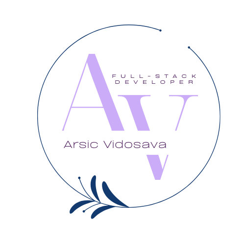

## Hi there 👋

Hi, I'm Vida — a full stack developer skilled in modern web technologies, backend development, and databases.

---

- 🎒 Graduated in 2024, I hold a Bachelor's degree in Electrical Engineering and Computing.
- 💻 I’m currently building my frontend skills.
- 🚀 I’m currently working on my personal website <a href = "https://vvidaarsic.netlify.app">vvidaarsic.netlify.app</a>. It's built using React, Next.js and Tailwind. Take a look, and give honest feedback. I really glad to hear it.

---

## What do I do?

## GitHub stats

<!--
**Vidosava98/Vidosava98** is a ✨ _special_ ✨ repository because its `README.md` (this file) appears on your GitHub profile.

Here are some ideas to get you started:

- 🔭 I’m currently working on ...
- 🌱 I’m currently learning ...
- 👯 I’m looking to collaborate on ...
- 🤔 I’m looking for help with ...
- 💬 Ask me about ...
- 📫 How to reach me: ...
- 😄 Pronouns: ...
- ⚡ Fun fact: ...
-->
