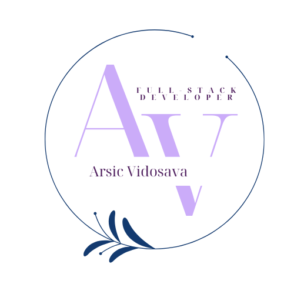

## Hi there 👋

Hi, I'm Vida — a full stack developer skilled in modern web technologies, backend development, and databases.

---

- 🎒 Graduated in 2024, I hold a Bachelor's degree in Electrical Engineering and Computing.
- 💻 I’m currently building my frontend skills.
- 🚀 I’m currently working on my personal website <a href = "https://vvidaarsic.netlify.app">vvidaarsic.netlify.app</a>. It's built using React, Next.js and Tailwind. Take a look, and give honest feedback. I really glad to hear it.

---

## What do I do?

<svg role="img" viewBox="0 0 24 24" xmlns="http://www.w3.org/2000/svg"><title>.NET</title><path d="M24 8.77h-2.468v7.565h-1.425V8.77h-2.462V7.53H24zm-6.852 7.565h-4.821V7.53h4.63v1.24h-3.205v2.494h2.953v1.234h-2.953v2.604h3.396zm-6.708 0H8.882L4.78 9.863a2.896 2.896 0 0 1-.258-.51h-.036c.032.189.048.592.048 1.21v5.772H3.157V7.53h1.659l3.965 6.32c.167.261.275.442.323.54h.024c-.04-.233-.06-.629-.06-1.185V7.529h1.372zm-8.703-.693a.868.829 0 0 1-.869.829.868.829 0 0 1-.868-.83.868.829 0 0 1 .868-.828.868.829 0 0 1 .869.829Z"/></svg>

<!--
**Vidosava98/Vidosava98** is a ✨ _special_ ✨ repository because its `README.md` (this file) appears on your GitHub profile.

Here are some ideas to get you started:

- 🔭 I’m currently working on ...
- 🌱 I’m currently learning ...
- 👯 I’m looking to collaborate on ...
- 🤔 I’m looking for help with ...
- 💬 Ask me about ...
- 📫 How to reach me: ...
- 😄 Pronouns: ...
- ⚡ Fun fact: ...
-->
